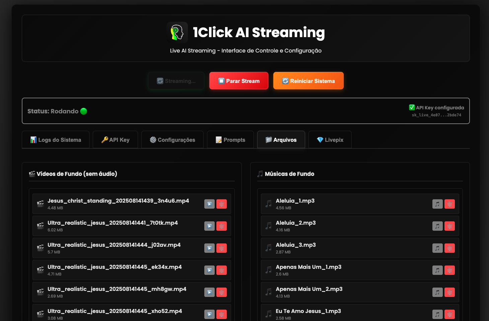

# Configuration

Configure your Live AI system settings.

## Web Interface

The web interface at `http://localhost:8080` is used to manage streaming and send files.

**Important**: All configurations must be done on [https://live.1click.ai/](https://live.1click.ai/)

### Streaming Manager

The streaming manager runs via web on port 8080 where the installer is running.

#### Features:

- **Easy Visual Interface**: Simple and intuitive web interface
- **Speaker Configuration**: View and adjust how the speaker will behave
- **Background Media**: Change music or background videos that rotate during the live stream
- **Message Monitoring**: Track messages that come through donations via QR code from your live stream





## API Key Configuration

**🔑 Get your API key at: [https://live.1click.ai/](https://live.1click.ai/)**

1. Visit the website to obtain your API key
2. Enter the API key in the Live AI configuration
3. Save your settings

## YouTube Stream Key

1. Follow the [YouTube Live Setup](YOUTUBE_LIVE.md) guide
2. Copy your stream key from YouTube Studio
3. Enter the stream key in the Live AI configuration

## Environment Variables

For Docker installations, you can configure these environment variables:

```yaml
environment:
  - STREAM_AUTO_START=true
  - API_KEY=your_api_key_here
  - YOUTUBE_STREAM_KEY=your_stream_key_here
```

## Persistent Data

Your configuration is automatically saved in the `./data` folder when using Docker.

## Next Steps

- [Getting Your Free API Key](GETTING_API_KEY.md) - Obtain your API key
- [YouTube Live Setup](YOUTUBE_LIVE.md) - Configure your YouTube live stream
- [Troubleshooting](TROUBLESHOOTING.md) - If you encounter any issues
