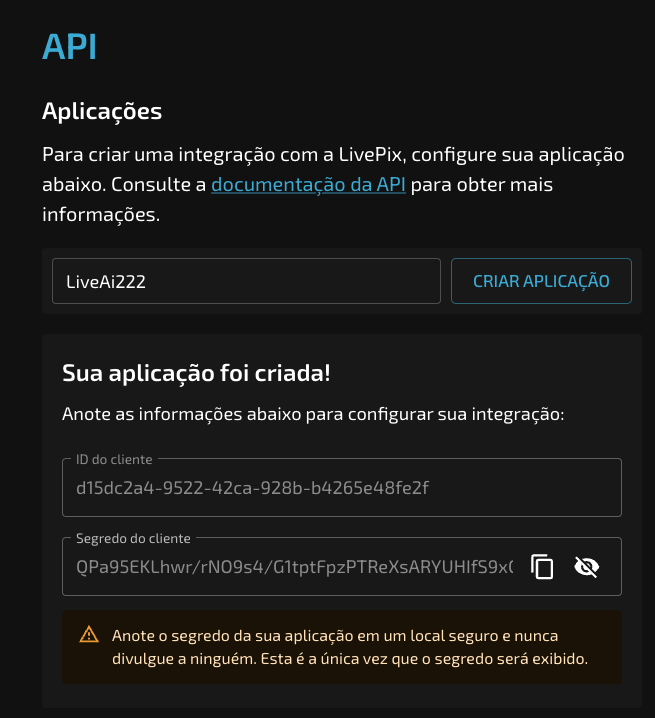
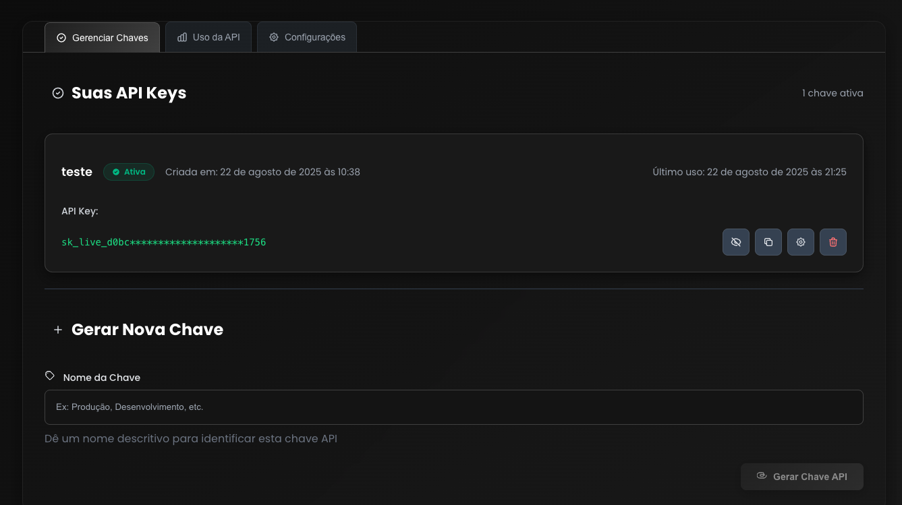
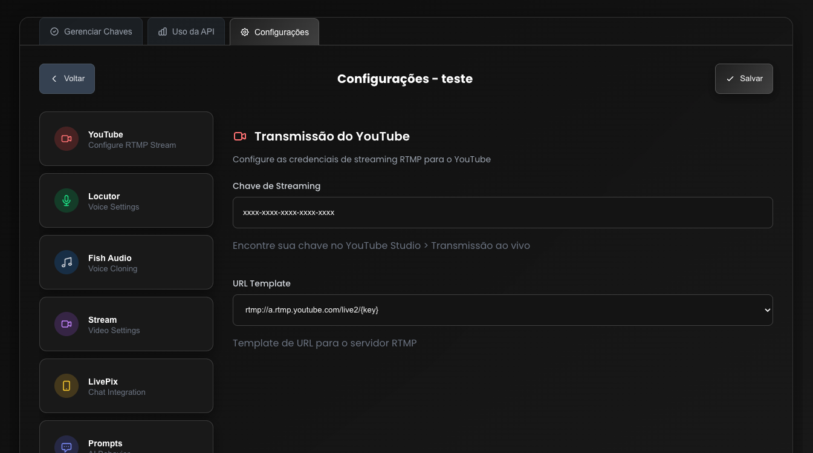
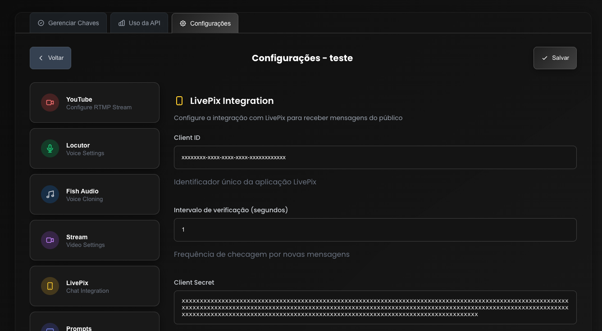

# Getting Your Free API Key

Follow these steps to obtain your free API key for Live AI.

## Navigation

- [← Back to README](README.md)
- [📖 Installation Guide](INSTALLATION.md)
- [🎥 YouTube Live Setup](YOUTUBE_LIVE.md)
- [⚙️ Configuration](CONFIGURATION.md)
- [🔧 Troubleshooting](TROUBLESHOOTING.md)

## Step 1: Register on LivePix

Register on [https://livepix.gg/](https://livepix.gg/)

## Step 2: Configure API Settings

After registration, click on "Configurações" >> "API" and create a new application, then copy the Client ID and Client Secret.

Also copy your LivePix URL, which is the username that appears at the top of the menu.

To configure the minimum values to receive messages, go to "Configurações" >> "Incentivos".

## Step 3: Register on Live AI Website

Register on [https://live.1click.ai/](https://live.1click.ai/)

If you don't have an invitation, request one in our community: [https://www.skool.com/1clickai](https://www.skool.com/1clickai)

Then register on the website and generate your key.

## Step 4: Edit Your Key

Edit the key and add your YouTube streaming key.

## Step 5: Configure LivePix Integration

Edit the Client ID and Client Secret obtained from the LivePix website: [https://livepix.gg/](https://livepix.gg/)

## Important Notes

- **API Key Security**: Keep your API key secure and never share it publicly
- **YouTube Stream Key**: Make sure your YouTube stream key is correctly entered
- **LivePix Credentials**: Obtain your Client ID and Client Secret from your LivePix account
- **Community Support**: Join our community for support and updates

## Next Steps

After obtaining your API key:

1. [Installation](INSTALLATION.md) - Install Live AI
2. [YouTube Live Setup](YOUTUBE_LIVE.md) - Configure your YouTube live stream
3. [Configuration](CONFIGURATION.md) - Configure the system settings
