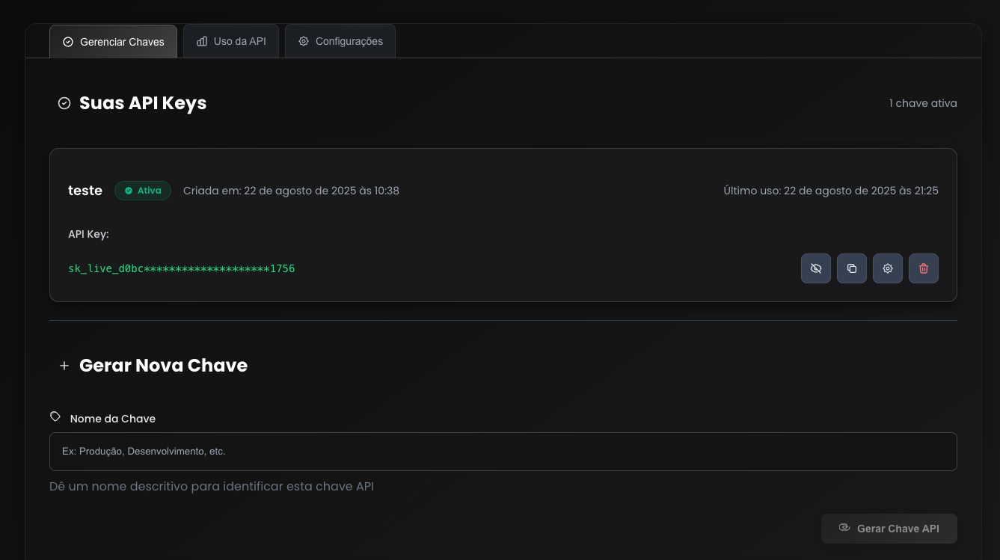

# Obtendo Sua Chave de API Gratuita

Siga estes passos para obter sua chave de API gratuita para o Live AI.

## Passo 1: Cadastro no LivePix

Cadastre-se em [https://livepix.gg/](https://livepix.gg/)

## Passo 2: Configurar Configurações da API

Após o cadastro, clique em "Configurações" >> "API" e crie uma nova aplicação, então copie o ID do Cliente e o Segredo do Cliente.

Também copie sua URL do LivePix, que é o username que aparece no topo do menu.

Para configurar os valores mínimos para receber mensagens, vá em "Configurações" >> "Incentivos".

## Passo 3: Cadastro no Site Live AI

Cadastre-se em [https://live.1click.ai/](https://live.1click.ai/)

Se você não tem convite, solicite um na nossa comunidade: [https://www.skool.com/1clickai](https://www.skool.com/1clickai)

Então cadastre-se no site e gere sua chave.

## Passo 4: Editar Sua Chave

Edite a chave e coloque a chave de streaming do YouTube.

## Passo 5: Configurar Integração LivePix

Edite o Client ID e Client Secret conseguidos no site LivePix: [https://livepix.gg/](https://livepix.gg/)

## Notas Importantes

- **Segurança da Chave de API**: Mantenha sua chave de API segura e nunca a compartilhe publicamente
- **Chave de Transmissão do YouTube**: Certifique-se de que sua chave de transmissão do YouTube está corretamente inserida
- **Credenciais LivePix**: Obtenha seu Client ID e Client Secret da sua conta LivePix
- **Suporte da Comunidade**: Junte-se à nossa comunidade para suporte e atualizações

## Próximos Passos

Após obter sua chave de API:

1. [Instalação](INSTALLATION_PT_BR.md) - Instale o Live AI
2. [Configuração do YouTube Live](YOUTUBE_LIVE_PT_BR.md) - Configure sua transmissão ao vivo
3. [Configuração](CONFIGURATION_PT_BR.md) - Configure as configurações do sistema
