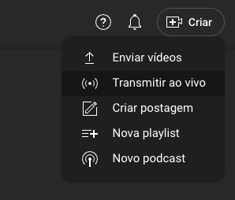
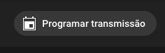
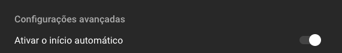
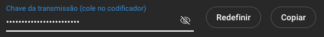

# YouTube Live Setup

Follow these steps to create your YouTube live stream:

## Navigation

- [← Back to README](README.md)
- [🔑 Getting Your Free API Key](GETTING_API_KEY.md)
- [📖 Installation Guide](INSTALLATION.md)
- [⚙️ Configuration](CONFIGURATION.md)
- [🔧 Troubleshooting](TROUBLESHOOTING.md)

## Step 1: Open YouTube Studio

Open YouTube Studio and click on "Create" → "Go live"

## Step 2: Schedule Your Stream

Click on "Schedule stream" - this is better because you can reuse it multiple times

## Step 3: Enable Auto-Start

Click on "Enable auto-start" to allow automatic streaming

## Step 4: Copy the Stream Key

Copy the stream key that will be used in the Live AI system

## Important Notes

- **Stream Key Security**: Never share your stream key publicly
- **Reusable Streams**: Scheduled streams can be reused multiple times
- **Auto-Start**: Enabling auto-start allows the system to begin streaming automatically
- **Backup**: Keep a copy of your stream key in a secure location

## Next Steps

After setting up your YouTube live stream:
1. [Configuration](CONFIGURATION.md) - Configure the Live AI system
2. [Troubleshooting](TROUBLESHOOTING.md) - If you encounter any issues
