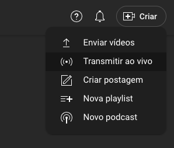

# Configuração do YouTube Live

Siga estes passos para criar sua transmissão ao vivo no YouTube:

## Passo 1: Abrir YouTube Studio

Abra o YouTube Studio e clique em "Criar" → "Ir ao vivo"

## Passo 2: Programar Sua Transmissão

Clique em "Programar transmissão" - é melhor porque você pode reutilizar várias vezes

## Passo 3: Ativar Início Automático

Clique em "Ativar início automático" para permitir streaming automático

## Passo 4: Copiar a Chave de Transmissão

Copie a chave de transmissão que será usada no sistema Live AI

## Notas Importantes

- **Segurança da Chave**: Nunca compartilhe sua chave de transmissão publicamente
- **Transmissões Reutilizáveis**: Transmissões programadas podem ser reutilizadas várias vezes
- **Início Automático**: Ativar o início automático permite que o sistema comece a transmitir automaticamente
- **Backup**: Mantenha uma cópia da sua chave de transmissão em local seguro

## Próximos Passos

Após configurar sua transmissão ao vivo no YouTube:
1. [Configuração](CONFIGURATION_PT_BR.md) - Configure o sistema Live AI
2. [Solução de Problemas](TROUBLESHOOTING_PT_BR.md) - Se encontrar algum problema
